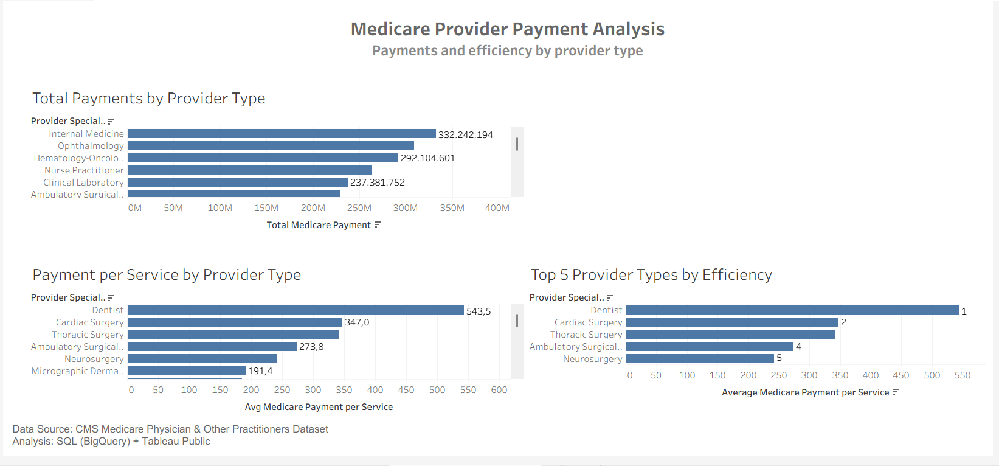

# Medicare Provider Analysis Dashboard

## Dashboard Preview

## Project Overview
This project analyzes Medicare physician provider data to understand differences in payments, charges, and service patterns across provider types.

The goal is to explore:
- Which provider types receive higher payments
- Payment efficiency per service
- Top provider types ranked by payment per service

## Dataset
Medicare Physician Provider Utilization dataset (subset used due to size limitations).

## Dashboard Explanation

### 1. Total Medicare Payments by Provider Type
This chart shows total Medicare payments aggregated by provider type.

Purpose:
To identify which provider types receive the highest total payments from Medicare.

---

### 2. Payment per Service Ratio by Provider Type
Metric used:
payment_to_service_ratio = Total Payment / Total Services

Purpose:
To measure how much Medicare pays on average per service for each provider type.

This helps understand payment intensity and differences in reimbursement patterns.

---

### 3. Top Provider Types by Payment per Service
This chart ranks provider types using:

ROW_NUMBER() over payment per service ratio.

Purpose:
To identify the provider types with the highest payment efficiency.

---

## Tools Used
- BigQuery (SQL analysis)
- Tableau Public (Visualization)
- GitHub (Project documentation)
- Data Cleaning
- Data Visualization

## Files Included
- Tableau_Medicare_Dashboard.twbx – Tableau workbook
- 01_provider_type_total_payments.csv – Query result
- 02_payment_per_service_by_provider_type.csv – Query result
- 03_top5_provider_types_by_payment_per_service.csv – Query result
- dashboard.png – Dashboard preview

## Tableau Public Dashboard
https://public.tableau.com/views/MedicareProviderPaymentDashboard/MedicareProviderPaymentAnalysis?:language=en-US&publish=yes&:sid=&:redirect=auth&:display_count=n&:origin=viz_share_link

